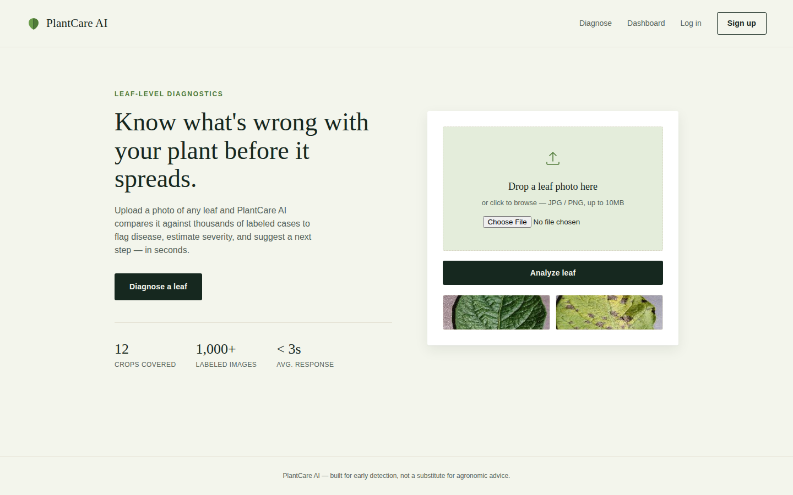
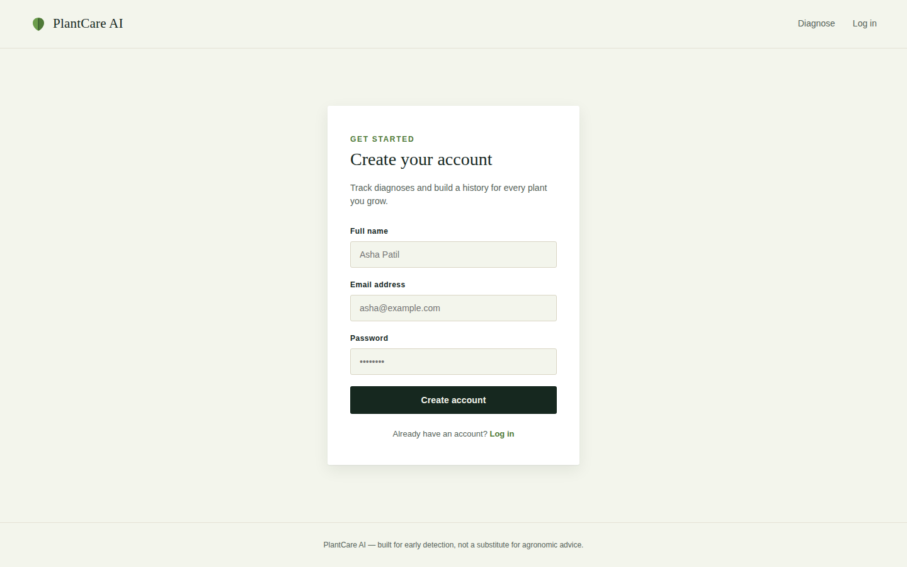
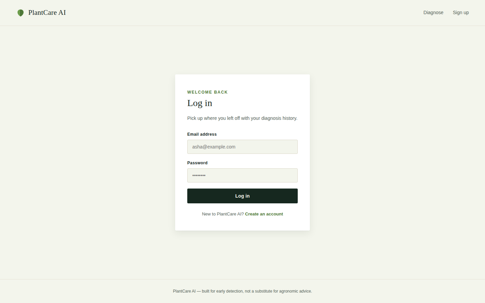
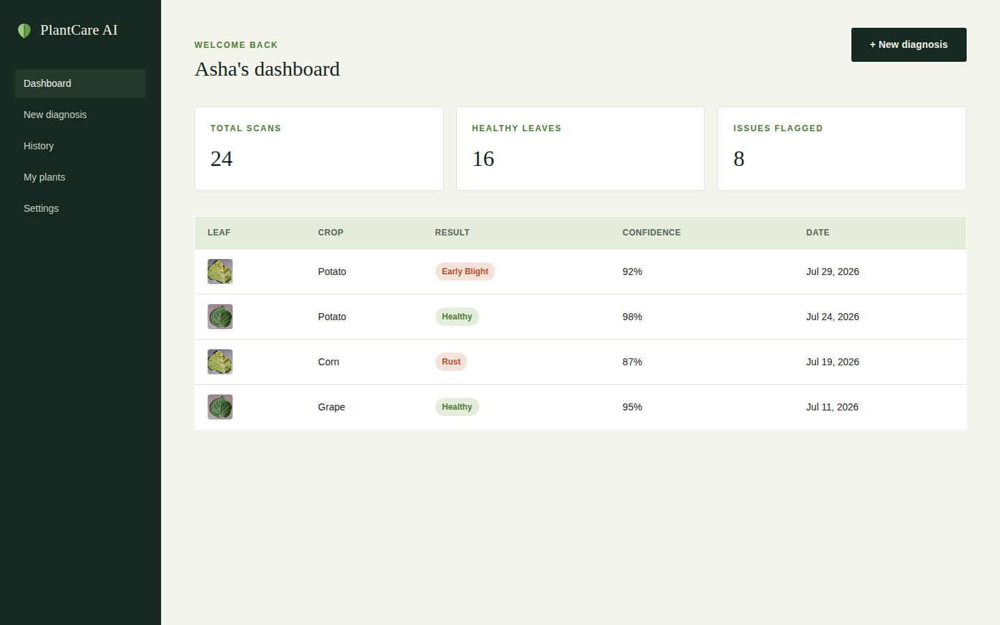
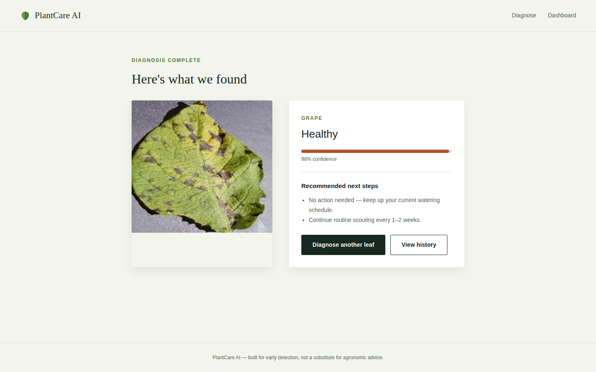

# 🌿 PlantCare AI

PlantCare AI is a web application that uses a deep learning model to detect plant diseases from leaf images. Users can upload a photo of a plant leaf through a Flask web interface and receive a prediction of the disease affecting the plant, helping farmers and gardeners identify problems early.

## Features

- 🔐 User registration and login
- 📊 Dashboard for logged-in users
- 📤 Upload a leaf image for analysis
- 🤖 Disease prediction powered by a TensorFlow/Keras CNN model
- 📄 Result page showing the predicted disease

## Tech Stack

- **Backend:** Python, Flask
- **Machine Learning:** TensorFlow / Keras, scikit-learn
- **Image Processing:** OpenCV, Pillow
- **Frontend:** HTML, CSS, JavaScript

## Project Structure

```
PlantCare-AI/
├── app/
│   ├── app.py                # Flask application entry point
│   ├── templates/            # HTML templates (login, register, dashboard, result, index)
│   └── static/                # CSS and JS assets
├── dataset/
│   └── Our Dataset/          # Training and test images
│       ├── Train/
│       └── test/
├── model/
│   └── plant_disease_model.h5   # Trained model weights
├── notebooks/
│   └── eda.py                # Exploratory data analysis
├── src/
│   ├── preprocessing.py      # Image preprocessing utilities
│   ├── train.py               # Model training script
│   └── predict.py             # Prediction/inference logic
├── requirements.txt
└── README.md
```

## Getting Started

### Prerequisites

- Python 3.9+
- pip

### Installation

1. Clone the repository
   ```bash
   git clone https://github.com/<your-username>/PlantCare-AI.git
   cd PlantCare-AI
   ```

2. Create and activate a virtual environment
   ```bash
   python -m venv venv
   source venv/bin/activate      # On Windows: venv\Scripts\activate
   ```

3. Install dependencies
   ```bash
   pip install -r requirements.txt
   ```

### Running the App

```bash
cd app
python app.py
```

Then open `http://127.0.0.1:5000` in your browser.

### Training the Model

If you want to retrain the model on the provided dataset:

```bash
python src/train.py
```

This reads images from `dataset/Our Dataset/`, trains a CNN, and saves the resulting weights to `model/plant_disease_model.h5`.

## Dataset

The `dataset/Our Dataset/` folder contains labeled leaf images split into `Train/` and `test/` sets, covering diseases such as black rot, early blight, powdery mildew, leaf spot, and anthracnose across crops like grapes, corn, okra, and chili.

## Project Status

The Flask app, all five pages (home/upload, register, login, dashboard, result), and styling are implemented and runnable end-to-end. Authentication is currently a stub (no real database or password hashing yet — see the `TODO`s in `app/app.py`), and predictions come from a demo response since `model/plant_disease_model.h5` is still a placeholder (0 bytes). To wire up real inference:

1. Train a model with `src/train.py` on `dataset/Our Dataset/` so it saves weights to `model/plant_disease_model.h5`.
2. Implement `src/predict.py` to load that model and classify an image.
3. Replace `mock_predict()` in `app/app.py` with a call into `src/predict.py`.

Contributions welcome!

## Screenshots

| Page | Preview |
|------|---------|
| **Home / Upload** |  |
| **Register** |  |
| **Login** |  |
| **Dashboard** |  |
| **Prediction Result** |  |

### Regenerating screenshots

If you change the UI and want fresh screenshots:

1. Run the app locally (see [Running the App](#running-the-app)).
2. Open each page in your browser (home/upload, register, login, dashboard, result) and take a screenshot.
   - Windows: `Win + Shift + S`
   - Mac: `Cmd + Shift + 4`
   - Linux: your screenshot tool of choice, or a browser extension like GoFullPage for full-page captures
3. Save each image into the `screenshots/` folder using the same filenames as above so the table keeps working.
4. Commit and push:
   ```bash
   git add screenshots/
   git commit -m "Update UI screenshots"
   git push
   ```

## Contributing

Contributions, issues, and feature requests are welcome. Feel free to open a pull request or an issue.

## License

This project currently has no license specified. Consider adding one (e.g., MIT) if you plan to share or open-source it — see [choosealicense.com](https://choosealicense.com/).